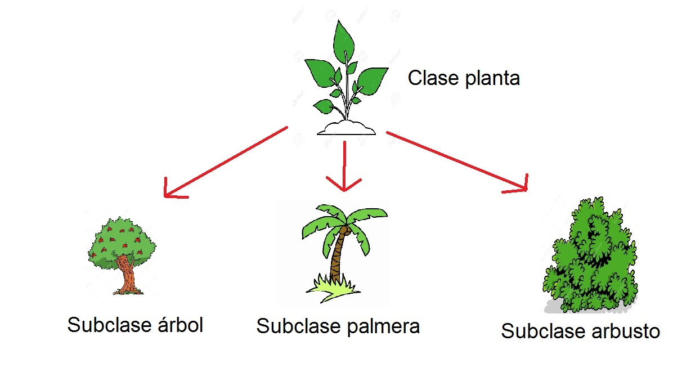
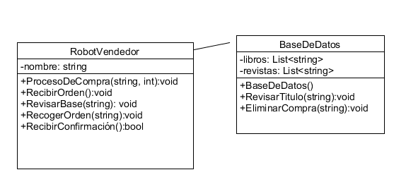

# Unidad 1: Introducción al paradigma de la programación orientado a objetos

## Instituto tecnológico de Tijuana

Alumno: Salasar Ramírez Octavio

Número de control: 18212265
___

### Tarea 1

___

#### *Paradigma*

Para mi, un paradigma es un conjunto de ideas, cosas, modelos, reglas, que definen un estado de cosas, se habla por ejemplo del cambio de paradigma en la ciencia, donde antes se creía que la Tierra era el centro del Universo, y la ciencia de esos tiempos se basaban en una serie de premisas que iban acorde con esa idea, tuvo que pasar tiempo para que las insconsistencias y errores de este paradigma dieran paso a uno nuevo que es el modelo Heleocentrico de Galilei. De igual forma depende el tipo de paradigma, este puede cambiar, conservarse o desecharse. El paradigma de la POO (programación orientada a objetos) representa una forma diferente de programar más inclinada a abstraer y representar objetos del mundo real con sus interacciones.

_Fuente:_
>(Anónimo) (24 de febrero) Etimología de paradigma. _Etimologías._ <http://etimologias.dechile.net/?paradigma>

#### *Abstracción*

La abstracción en la capacidad de la mente humana de aislar lo escencial de lo secundario de las cosas. Abstraer es identificar con la razón las cualidades escenciales que nos sirven de las que no para poder representar objetos, situaciones o cosas. Podríamos decir que la escritura es un sistema de abstracción, ya que de los objetos sólo tomamos la palabras que usamos para nombrar la realidad y en base de un sistema de signos los plasmamos en papel para poder comunicarnos sin tener que representar las cosas por medio de dibujos que serían más complicados e inexactos. Otro ejemplo de la abstracción serían las matemáticas que nacieron de un proceso de este tipo, en algún momento de la historia se pasó de represntar a las ovejas y las vacas que se tenían a representarlas por medio de piedritas u objetos más pequeñas que sólo representaban al elemento en sí, luego se paso a un sistema de númeración decimal que representaba más eficientemente las cantidades, así, si se tenían que contar cosas como la fortuna en oro de un rey, era más eficiente usar símbolos que cabían en un pequeño espacio. La abstracción es una de las habilidades que ha echo que la sociedad avance en un muchos sentidos.

_Fuente:_
>(Anónimo) (Sin fecha) Pensamiento abstracto. _EcuRed._ <https://www.ecured.cu/Pensamiento_abstracto>

#### *¿Por qué decimos que la Clase es el mecanismo de abstracción de los lenguajes OO?*

Debido a que las clases funcionan como plantillas o moldes de objetos del mundo real, creados a partir de la abstracción de las características y comportamientos más importantes del objeto u ente que queramos representar. Las clases en c# se compone de los atributos y métodos, que en la programación son una forma de representar características de la realidad para poder trabajar con ella.

#### *Encapsulamiento*

El encapsulamiento es la capacidad de las clases de ocultar, por así decilo el acceso a los atributos de los objetos, para que el usuario no se preocupe por las características internas. Como ejemplo tenemos este reloj donde el funcionamiento interno no es visible para las personas no interesadas en él, lo que nosotros vemos es la presentación del reloj y las manecillas que nos sirven para ver la hora.

>
>

Es importante el encapsulamieto debido a que protege la integridad del código, debido a que se evita que se manipule de forma correcta, además que le resulta más fácil al usuaio la interacción.

#### *Herencia*

La herencia es un poderoso método de creación de clases, el cual nos permite basarnos en una clase padre para crear una subclase que "hereda" los atributos o métodos de la clase padre, más aparte tiene sus características particulares.

___

### UML: diagrama de clases

 La falta de estandarización  en  la  manera  de  representar  gráficamente  un  modelo  impedía  que  los  diseños  gráficos  realizados   se   pudieran   compartir   fácilmente   entre   distintos diseñadores. Debido a esto se creo el Lenguaje Unificado  de  Modelado  (UML:  Unified  Modeling  Lan-guage). 
 El  lenguaje  UML  tiene  una  notación  gráfica  muy  expresiva  que  permite  representar  en  mayor  o  menor  medida  todas  las  fases  de  un  proyecto  informático:  desde  el  análisis  con  los  casos  de  uso,  el  diseño  con  los  diagramas  de  clases,  objetos,  etc.,  hasta  la  imple-mentación  y  configuración  con  los  diagramas  de  des-pliegue.

#### Historia

El  lenguaje  UML  comenzó  a  gestarse  en  octubre  de 1994 [1], cuando Rumbaugh se unió a la compañía Rational fundada por Booch (dos reputados investiga-dores en el área de metodología del software). El ob-jetivo  de  ambos  era  unificar  dos  métodos  que  habían  desarrollado: el método Booch y el OMT (Object Mode-lling Tool ). El primer borrador apareció en octubre de 1995. En esa misma época otro reputado investigador, Jacobson,  se  unió  a  Rational  y  se  incluyeron  ideas  suyas. Estas tres personas son conocidas como los “tres amigos”. Además, este lenguaje se abrió a la colabora-ción  de  otras  empresas  para  que  aportaran  sus  ideas.  Todas estas colaboraciones condujeron a la definición de la primera versión de UML.

Esta primera versión se ofreció a un grupo de tra-bajo  para  convertirlo  en  1997  en  un  estándar  del  OMG          (Object Management Group <http://www.omg.org>).

#### Diagrama de clases 

UML sirve para el modelado completo de sistemas complejos, tanto en el diseño de los sistemas software como para la arquitectura hardware donde se ejecuten.

Un  diagrama  es  la  representación  gráfica  de  un  conjunto de elementos con sus relaciones. En concre-to,  un  diagrama  ofrece  una  vista  del  sistema  a  modelar. El diagrama de clases muestra un conjunto de clases, interfaces  y  sus  relaciones.  Éste  es  el  diagrama  más  común a la hora de describir el diseño de los sistemas orientados  a  objetos. El propósito de un diagrama de clase es describir las clases que conforman el modelo de un  determinado  sistema.
Se  puede  decir  que  existen  tres  perspectivas  diferentes  desde  las  cuales  se  pueden utilizar los diagramas de clase:

* **Conceptual**:El  diagrama  de  clase  representa  los  conceptos  en  el  dominio  del problema   que   se   está   estudiando.   Este   modelo   debe   crearse   con   la   mayor independencia posible de la implementación final del sistema.
* **Especificación:** El diagrama de clase refleja las interfaces de las clases, pero no su implementación. Aquí las clases aparecen más cercanas a los tipos de datos, ya que un   tipo   representa   una   interfaz   que   puede   tener   muchas   implementaciones diferentes.
* **Implementación:** Esta vista representa las clases tal cual aparecen en el entorno de implementación

Algunas de herramientas para el uso del UML son: MagicDraw, Papyrus UML, Modelio, Argo UML, Star UML, UMLet.

_Fuentes:_
><http://www.disca.upv.es/enheror/pdf/ActaUML.PDF>
<https://repositorio.grial.eu/bitstream/grial/353/1/DClase.pdf>

#### Propuesta

Mi máquina se tratara de una especie de robot de autoservicio que tome ordenes,revise una base datos, obtenga el pago, busque el producto, se lo entrega al cliente, obtenga una confirmación y borre el objeto de la base de datos.

